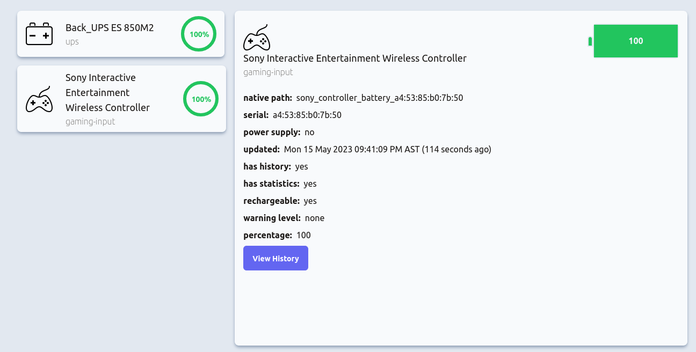

# UPOWER DASHBOARD
Simple Dashboard to display some of the statistics reported from upower (linux) command. Project was inspired from the need for a visual indication of the battery level of a APCES850M2 UPS and potentially auto shutdown features. The project
was written with [React⚛](https://reactjs.org/) (js) with [vite](https://vitejs.dev/)⚡ for the frontend and nodejs with express🚀 (running with [bun](https://bun.sh/)) for the backend. 

## 📝 Getting Started

*`upower` must be installed and available on the machine running the server code.*

```bash
# clone it
git clone git@github.com:JChris246/upower-dashboard.git
cd upower-dashboard

# Install server dependencies
cd server
bun install

# Install client dependencies
cd client
npm install

# Run the client and the server
cd client
npm run dev

cd server
bun start
```
*Note: a .env file should be created and filled in with the appropriate values based on the .env.sample file.*

After launching the client and the server, the application should be accessible in the browser at http://localhost:5173/

*Note: The backend should also be able run with node, however it has not been tested*

## ✨ Preview

<p>
    
    <br/>
    <i>Desktop view of the devices and detail view of gaming controller device (fully charged)</i>
</p>

<p>
    
    <br/>
    <i>Desktop view of the devices and detail view of gaming controller device (45% charge)</i>
</p>

<p>
    
    <br/>
    <i>Desktop view showing the ups device discharging (as reported by upower)</i>
</p>

<p>
    
    <br/>
    <i>Desktop view showing the ups device charging (as reported by upower)</i>
</p>

<p>
    
    <br/>
    <i>Mobile view of the device list</i>
</p>

<p>
    
    <br/>
    <i>Mobile view of the device detail section</i>
</p>