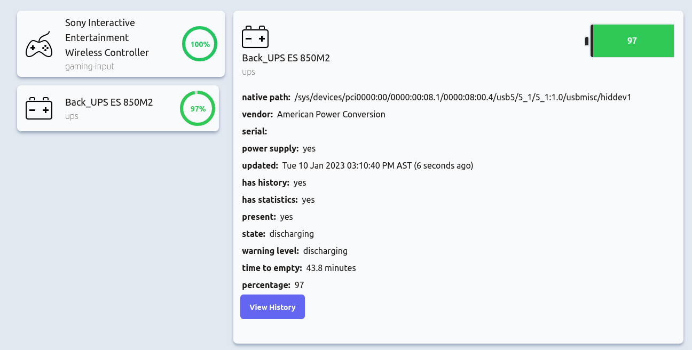
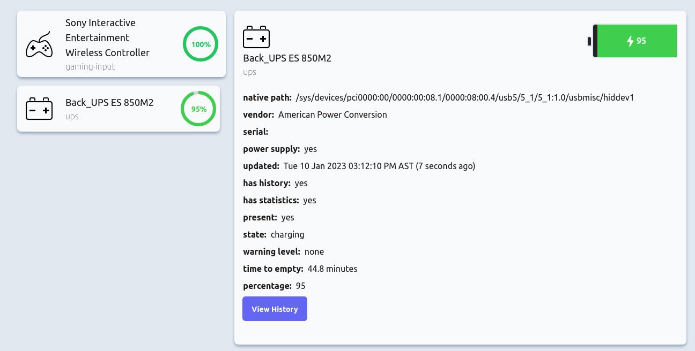
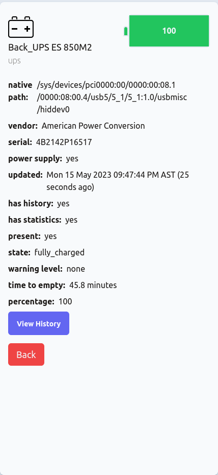

# UPOWER DASHBOARD
Simple Dashboard to display some of the statistics reported from upower (linux) command. Project was inspired from the need for a visual indication of the battery level of a APCES850M2 UPS and potentially auto shutdown features. The project
was written with [React⚛](https://reactjs.org/) (js) and [tailwindcss](https://tailwindcss.com/) using [vite](https://vitejs.dev/)⚡ for the frontend and nodejs with [express🚀](https://expressjs.com/) for the backend.

## 📝 Getting Started

*`upower` must be installed and available on the machine running the server code.*

```bash
# clone it
git clone git@github.com:JChris246/upower-dashboard.git
cd upower-dashboard

# Install server dependencies
cd server
npm install

# Install client dependencies
cd client
npm install

# Run the client and the server
cd client
npm run dev

cd server
node start
```
*Note: a .env file should be created and filled in with the appropriate values based on the .env.sample file.*

After launching the client and the server, the application should be accessible in the browser at http://localhost:5173/

## ✨ Preview

<p>
    
    <br/>
    <i>Desktop view of the devices and detail view of gaming controller device (fully charged)</i>
</p>

<p>
    
    <br/>
    <i>Desktop view of the devices and detail view of gaming controller device (45% charge)</i>
</p>

<p>
    
    <br/>
    <i>Desktop view showing the ups device discharging (as reported by upower)</i>
</p>

<p>
    
    <br/>
    <i>Desktop view showing the ups device charging (as reported by upower)</i>
</p>

<p>
    
    <br/>
    <i>Mobile view of the device list</i>
</p>

<p>
    
    <br/>
    <i>Mobile view of the device detail section</i>
</p>

## 📟 Install as a systemd service

A sample system template is provided at the root of the project that can be used to install the app as a systemd service to run in the background and at startup.

Using the template, replace `yourusername` with the username you want to run the app as, `/path/to/server/dir` with the path to your the service folder (of this project) on your system. Save the changes and move the file to `/etc/systemd/system/`.

*You will need root permissions to perform the last operation*

Reload the systemd daemon by running the command: `sudo systemctl daemon-reload`.
Start your new service by running the command: `sudo systemctl start upower_dashboard`.
Verify that your service is running by running the command: `sudo systemctl status upower_dashboard`.
If everything is working correctly, you should see output indicating that the service is running. You can also enable your service to start automatically at boot time by running the command: `sudo systemctl enable upower_dashboard`.

*Note the frontend will need to be built with `npm run build` and the contents of the dist folder should be copied and placed in a folder `static` (which needs to be created) in the server folder.* 

## 🐳 Building a docker image

*Running this app as a docker container is not recommended as it requires the container to run in privileged mode, giving the container full access to the host system, including all devices and system capabilities, thereby posing a security risk*

To build the docker image yourself you can use docker build -t upower-dashboard:0.1.0 . while in the root of the project. This will read and perform the actions described in the Dockerfile.

Alternatively, if you have docker-compose installed there is a docker-compose.yml provided that can be used to build and run the application with the command: `docker-compose up --build -d`. *The `--build` flag is only required if changes are made and the image should be rebuilt*.